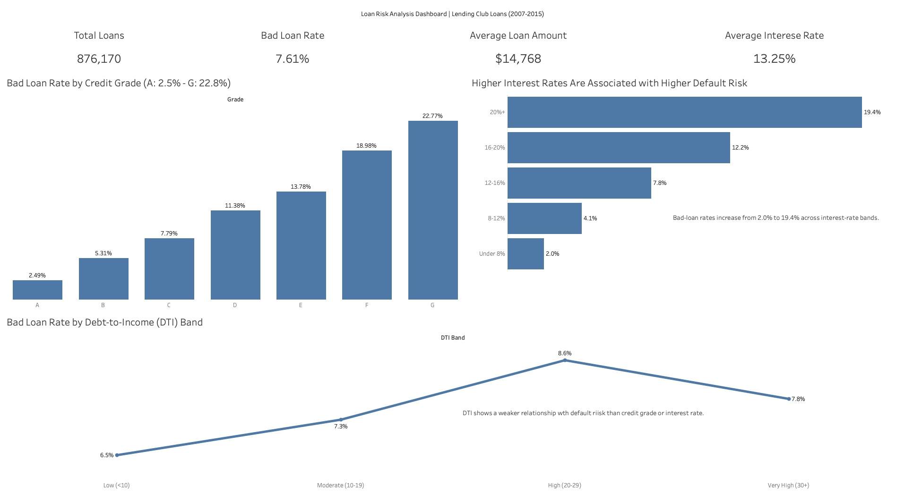

# Loan Risk Analysis using SQL & Tableau

## Project Overview

Financial institutions face a constant challenge: growing their lending business while managing the risk of borrower defaults. Understanding the factors that influence loan performance is critical for maintaining a healthy loan portfolio and minimizing credit losses.

In this project, I analyzed historical Lending Club loan data to identify key drivers of loan default risk and uncover actionable insights that could help improve lending decisions.

The analysis was conducted using PostgreSQL for data exploration and risk analysis, and Tableau for dashboard development and data visualization.

---

## Business Problem

The objective of this project was to answer the following questions:

* Which borrower characteristics are most strongly associated with loan defaults?
* Does loan size influence default risk?
* How do credit grades, debt burden, and interest rates affect loan performance?
* What insights can help lenders improve portfolio quality and reduce credit risk?

---

## Dataset Information

**Source:** Lending Club Loan Dataset

**Analysis Period:** June 2007 – December 2015

**Total Loans Analyzed:** 876,170

### Key Variables Used

* Loan Amount
* Interest Rate
* Credit Grade
* Debt-to-Income Ratio (DTI)
* Annual Income
* Loan Purpose
* Loan Status
* Employment Length
* State

---

## Tools Used

### PostgreSQL

* Data cleaning and exploration
* Risk analysis
* Aggregations and business metric calculations

### Tableau

* Dashboard development
* KPI reporting
* Risk visualization

### Git & GitHub

* Version control
* Project documentation
* Portfolio presentation

---

## Dashboard



The dashboard highlights the primary risk indicators identified during the analysis and summarizes portfolio performance through key metrics and visualizations.

---

## Analysis Process

### 1. Data Exploration

Initial exploration was performed to understand the structure and characteristics of the dataset.

Key metrics identified:

* Total Loans: 876,170
* Bad Loan Rate: 7.61%
* Average Loan Amount: $14,767
* Average Interest Rate: 13.25%

The dataset contained loan records spanning more than 8 years, providing sufficient history to evaluate lending performance across different borrower segments.

---

### 2. Risk Analysis

Several borrower and loan characteristics were analyzed to determine their relationship with default risk.

The analysis focused on:

* Credit Grade
* Interest Rate Bands
* Debt-to-Income Ratio (DTI)
* Loan Purpose
* Annual Income
* Employment Length
* Loan Amount
* Geographic Risk Patterns

---

## Key Findings

### 1. Credit Grade Is the Strongest Risk Indicator

Bad-loan rates increased significantly as credit quality declined.

| Grade | Bad Loan Rate |
| ----- | ------------: |
| A     |         2.49% |
| G     |        22.77% |

Borrowers in Grade G experienced nearly 9 times the bad-loan rate of borrowers in Grade A.

This suggests that Lending Club's grading system effectively differentiates borrower risk.

---

### 2. Higher Interest Rates Are Associated with Higher Default Risk

Bad-loan rates increased consistently across interest-rate bands.

| Interest Rate Band | Bad Loan Rate |
| ------------------ | ------------: |
| Under 8%           |         2.00% |
| 20%+               |        19.38% |

Borrowers paying the highest interest rates experienced nearly 10 times the bad-loan rate of borrowers in the lowest-rate segment.

This indicates that interest rates closely reflect borrower risk profiles.

---

### 3. Debt Burden Has a Moderate Relationship with Risk

Borrowers with higher debt-to-income ratios generally experienced elevated bad-loan rates.

| DTI Band         | Bad Loan Rate |
| ---------------- | ------------: |
| Low (<10)        |         6.54% |
| Moderate (10-19) |         7.31% |
| High (20-29)     |         8.60% |
| Very High (30+)  |         7.76% |

While DTI showed a relationship with risk, it was weaker than the patterns observed for credit grades and interest rates.

---

### 4. Loan Amount Has Minimal Impact on Default Risk

Bad-loan rates remained remarkably consistent across all loan-size bands.

| Loan Amount Band | Bad Loan Rate |
| ---------------- | ------------: |
| Under $5K        |         7.70% |
| $5K-$10K         |         7.45% |
| $10K-$20K        |         7.72% |
| $20K+            |         7.54% |

This finding suggests that borrower quality is a far more important predictor of default risk than loan size.

---

### 5. Small Business Loans Exhibit Elevated Risk

Among major loan purposes, small-business loans demonstrated the highest bad-loan rates.

This indicates that additional underwriting scrutiny may be beneficial when evaluating loans issued for business-related purposes.

---

## Business Recommendations

Based on the analysis, the following recommendations can help improve portfolio quality:

1. Continue prioritizing borrower quality metrics such as credit grade and interest rate when evaluating applications.

2. Apply additional review procedures for high-risk grades (F and G) due to significantly elevated default rates.

3. Incorporate debt-to-income ratio into risk assessment frameworks while recognizing its lower predictive power compared to credit grade.

4. Focus risk management efforts on borrower characteristics rather than loan size, which demonstrated minimal relationship with loan performance.

5. Implement enhanced risk evaluation procedures for small-business lending segments.

---

## Repository Structure

```text
loan-risk-analysis/
│
├── outputs/
│   ├── loan_risk_dashboard.png
│   ├── grade_risk.png
│   ├── interest_rate_risk.png
│   └── dti_risk.png
│
└── sql/
    ├── 01_data_exploration.sql
    ├── 02_risk_analysis.sql
    └── 03_dashboard_queries.sql
```

---

## Conclusion

The analysis demonstrates that borrower quality indicators—including credit grade, interest rate, and debt burden—are substantially more predictive of loan defaults than loan size or employment tenure.

Among all variables analyzed, credit grade emerged as the strongest predictor of risk, reinforcing the importance of effective borrower risk segmentation in lending decisions.

This project showcases SQL-based analytical workflows, risk analysis techniques, business-focused data interpretation, and dashboard development using Tableau.
